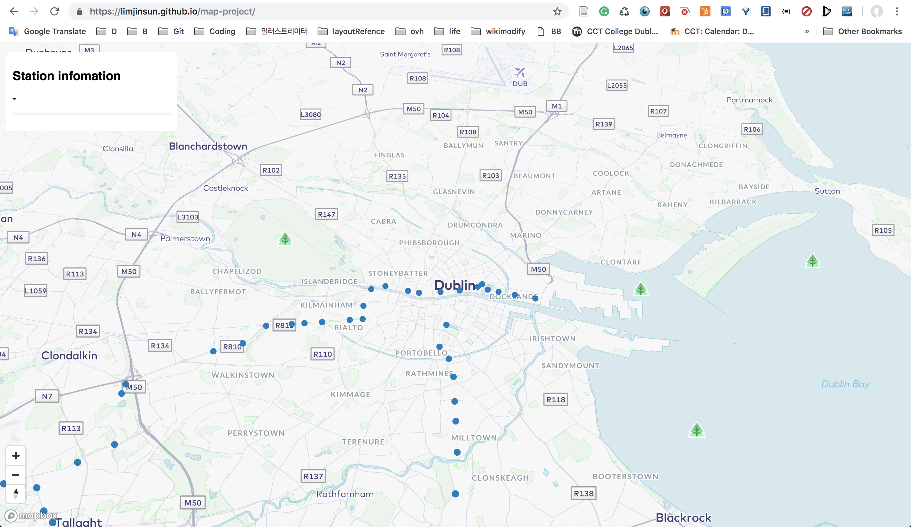
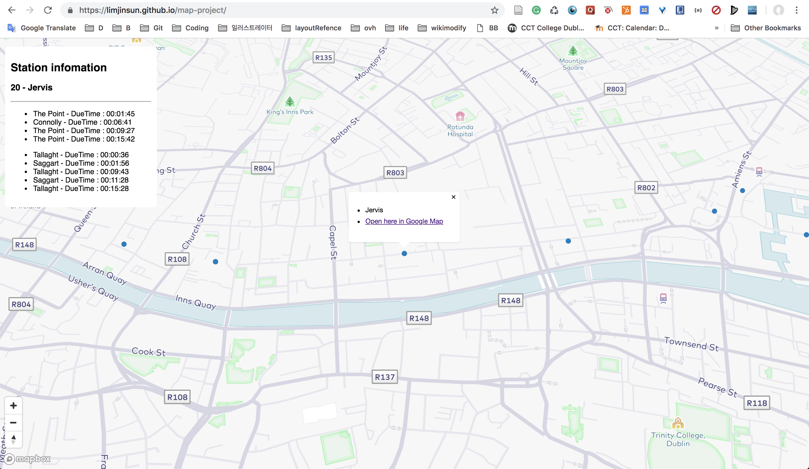

## Realtime Dublin Luas API Due time application with MapBox using React

This project was built to deliver Realtime information of each Luas station in Dublin. React framework used for the frontend along with Mapbox. I had to make my own JSON friendly API for getting real-time Luas information since It did not exist. API example.
© Jin Lim

[api example](https://wiki.liffeyireland.com:8443/Luas/21)

This project was bootstrapped with [Create React App](https://github.com/facebookincubator/create-react-app).

Below you will find some information on how to perform common tasks. 
You can find the most recent version of this guide [here](https://github.com/facebookincubator/create-react-app/blob/master/packages/react-scripts/template/README.md).

For the project to build, **these files must exist with exact filenames**:

* `public/index.html` is the page template;
* `src/index.js` is the JavaScript entry point.

You can delete or rename the other files.

You may create subdirectories inside `src`. For faster rebuilds, only files inside `src` are processed by Webpack. 
You need to **put any JS and CSS files inside `src`**, otherwise Webpack won’t see them.

Only files inside `public` can be used from `public/index.html`. 
Read instructions below for using assets from JavaScript and HTML.

You can, however, create more top-level directories. 
They will not be included in the production build so you can use them for things like documentation.

